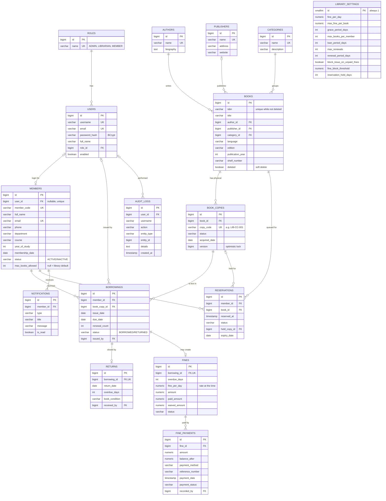

# ER Diagram

Rendered automatically on GitHub (Mermaid). The source of truth is `database/schema.sql`.

## Design notes (useful in a viva)

- **Book vs. copy.** `books` is the title (one ISBN); `book_copies` is each physical item with its own code. Two copies of *Clean Code* are one `books` row and two `book_copies` rows.
- **Nothing that can be calculated is stored.** Total/available copies, a member's current number of books and outstanding fines are computed with `COUNT`/`SUM`, so they can never go out of sync.
- **Overdue is derived**, not a stored status: a borrowing is overdue when `status = 'BORROWED' AND due_date < today`.
- **Integrity in the database, not only in Java:** `CHECK` constraints (e.g. `due_date >= issue_date`, `paid_amount + waived_amount <= amount`), a partial unique index so one copy can never have two active loans, and `ON DELETE RESTRICT` foreign keys so history cannot be deleted by accident.
- **Normalisation:** every non-key column depends only on its table's key (3NF). Author, publisher and category names live in their own tables and are referenced by id.
